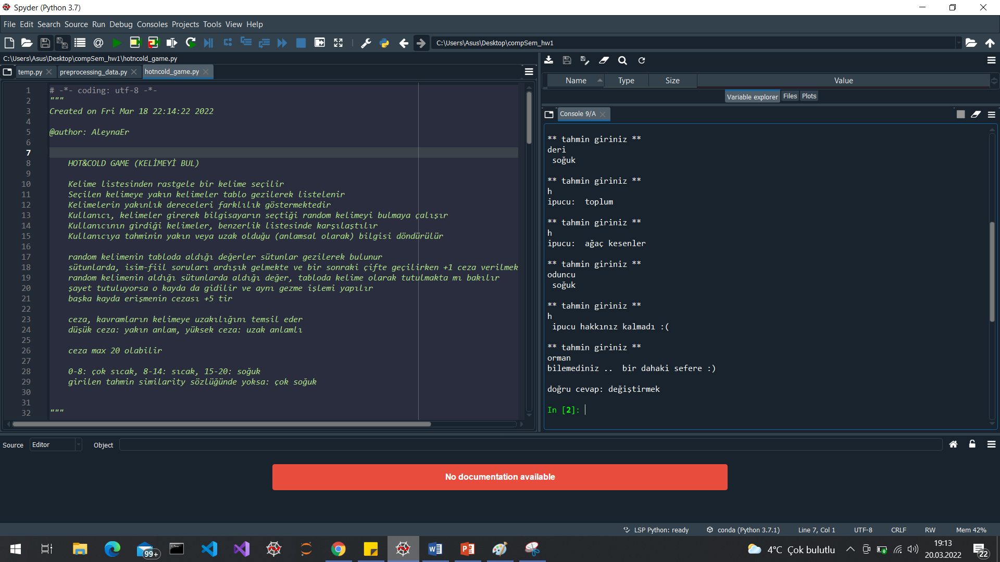

# Hesaplamalı Anlambilim 1.Ödevi

## Kelimeyi Bul oyunu

Proje, YTÜ Bilgisayar Mühendisliği Doktora Programı kapsamında yürütülen Hesaplamalı Anlambilim dersinde, YTÜ öğrencileri tarafından etiketlenen ve ders danışmanı  Doç.Dr. M. Fatih Amasyalı tarafından düzenlenen veriler kullanılarak gerçekleştirilmiştir. Ham veriye buradan [isim ve fiiller](https://sites.google.com/view/mfatihamasyali/hesaplamal%C4%B1-anlambilim?authuser=0) ulaşabilirsiniz.

Oyun, temel anlamda bir sıcak-soğuk oyunudur. Oyunun amacı, bilgisayar tarafından random seçilen kelimenin (isim veya fiil olabilir) kullanıcı tarafından tahmin edilmesidir. Kullanıcı girdi olarak kelime veya kelime grubu girebilmektedir. Kullanıcının girdiği değerin istenilene (random seçilen kelimeye) anlamsal olarak yakın olmasına göre sıcak-soğuk dönüşü yapılır. 

0-8: çok sıcak (çok yakın), 8-14: sıcak, 15-20: soğuk, girilen tahmin similarity sözlüğünde yoksa: çok soğuk

Random kelime seçildiğinde, bu kelimeye yakın anlamlı kavramlar tabloda gezilerek hesaplanır ve dictionary oluşturulur. Uzaklık (ceza) kavramı ve yakın anlamlılar sözlüğünün oluşturulması hakkında detaylı bilgi için proje raporunu inceleyebilirsiniz.

Oyun başlatıldığında, yeni bir ranndom kelime seçilir ve buna uygun yakın anlamlılar sözlüğü oluşturulur.
Kullanıcının 5 tahmin ve 3 ipucu isteme hakkı vardır.

